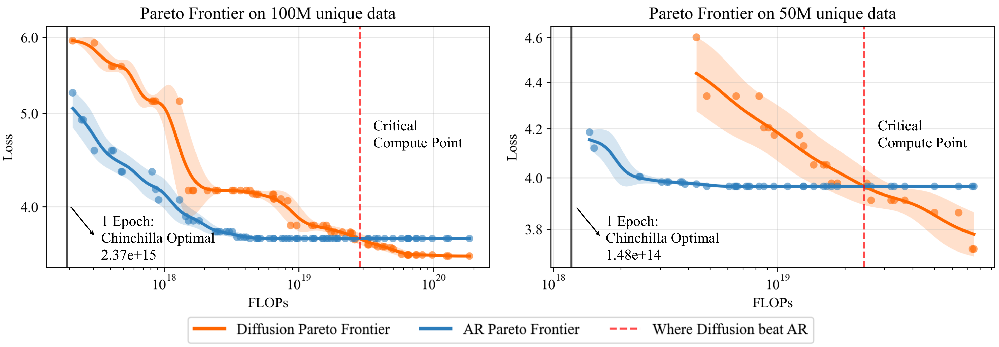

<div align="center">

<!-- TITLE -->
# **Diffusion Beats Autoregressive in Data-Constrained Settings**
[](preview.png)

[](https://arxiv.org/abs/2507.15857)
[](http://diffusion-scaling.github.io)
</div>

This is the official implementation of our paper [Diffusion Beats Autoregressive in Data-Constrained Settings](https://diffusion-scaling.github.io/) by [Mihir Prabhudesai*](https://mihirp1998.github.io/), [Mengning Wu*](https://www.linkedin.com/in/mengning-wu-2ba8562ba/), [Amir Zadeh](#), [Katerina Fragkiadaki](https://www.cs.cmu.edu/~katef/), [Deepak Pathak](https://www.cs.cmu.edu/~dpathak/)


<!-- DESCRIPTION -->
## Abstract
Autoregressive (AR) models have long dominated the landscape of large language models, driving progress across a wide range of tasks. Recently, diffusion-based language models have emerged as a promising alternative, though their advantages over AR models remain underexplored. In this paper, we systematically study masked diffusion models in data-constrained settings-where training involves repeated passes over limited data and find that they significantly outperform AR models when compute is abundant but data is scarce. Diffusion models make better use of repeated data, achieving lower validation loss and superior downstream performance. We find new scaling laws for diffusion models and derive a closed-form expression for the critical compute threshold at which diffusion begins to outperform AR. Finally, we explain why diffusion models excel in this regime: their randomized masking objective implicitly trains over a rich distribution of token orderings, acting as an implicit data augmentation that AR's fixed left-to-right factorization lacks. Our results suggest that when data, not compute, is the bottleneck, diffusion models offer a compelling alternative to the standard AR paradigm.


## TODOS
- [x] [Quick Start Instructions](#quick-start-instructions)
- [x] [Installation Instructions](FULL_README.md#installation)
- [x] [Data Preprocessing Instructions](FULL_README.md#data-preprocessing)
- [x] [Model Pretraining Instructions](examples_scaling/training/TRAIN.md)
- [x] [Model Evaluation Instructions](examples_scaling/evaluation/EVAL.md)
- [x] [Release all the Subset Datasets](https://huggingface.co/datasets/ZahlenReal/diffusion_data_constraint_c4subsets)
- [x] [Release Pretrained Checkpoints](https://huggingface.co/ZahlenReal/diffusion_data_constraint_models/tree/main/100m_new)
- [x] [Downstream Instructions](examples_scaling/downstream/DOWNSTREAM.md)
- [ ] [Additional Experiments Configurations in the paper](examples_scaling/training/TRAIN.md#different-experimental-configurations)


## Quick Start Instructions

Want to quickly try our Diffusion beat AR scenario? 

Quickstart guide for training our best found config on Diffusion and AR for 100M unique tokens. This code is tested on 8x H100 gpus.

Follow these 4 simple steps:

### Step 1: Install Dependencies
```bash
bash install.sh
```
NOTE: This script will install the default environment for the paper via micromamba.  If you want to use a different environment or want to manually go through the install script or meet any issues during installation, please refer to [FULL_README.md](FULL_README.md).

### Step 2: Download 100M Token Dataset
Download the 100M token dataset and the validation dataset from [here](https://huggingface.co/datasets/ZahlenReal/diffusion_data_constraint_quickstart) and place it in the `data` directory. We provide a script to automatically download the dataset and place them in the `data` directory.
```bash
bash download.sh
```

### Step 3: Run Training Scripts
```bash
# Train AR model
bash examples_scaling/quickstart/train_ar.sh

# Train diffusion model
bash examples_scaling/quickstart/train_mdm.sh
```

### Step 4: Run Evaluation Scripts
```bash
# Evaluate AR model
bash examples_scaling/quickstart/eval_ar.sh

# Evaluate diffusion model
bash examples_scaling/quickstart/eval_mdm.sh
```

**That's it!** The scripts will automatically:
Use our best configurations for the 100M token scenario to train both AR and Diffusion models with optimal hyperparameters. This will show you how Diffusion outperforms AR in data-constrained settings

**Expected Result:** Diffusion should achieve lower validation loss and better downstream performance compared to AR when training on limited data.

**Pretrained Checkpoints:**
We provided the pretrained checkpoints for the best configurations for AR and Diffusion models trained on 100M tokens in [Hugging Face](https://huggingface.co/ZahlenReal/diffusion_data_constraint_models/tree/main/100m_new).

## Full README

For comprehensive instructions on training models with different configurations, data preprocessing, and advanced experimental setups, please refer to [FULL_README.md](FULL_README.md).

The full documentation covers:
- Detailed installation for different architectures (x86_64, AArch64, B200s)
- Complete data preprocessing workflows
- All experimental configurations from the paper
- Advanced training and evaluation options
- Downstream task evaluation


## Acknowledgments

This codebase is built upon several foundational repositories and implementations:

- **Base Framework**: Built on [Megatron-DeepSpeed](https://github.com/deepspeedai/Megatron-DeepSpeed) as a detached fork
- **Implementation References**: Incorporates modifications for data preprocessing and improvements from [TurkuNLP's Megatron-DeepSpeed](https://github.com/TurkuNLP/Megatron-DeepSpeed)
- **Core Methodology**: Implements Masked Diffusion Model architecture and evaluation based on [SMDM](https://github.com/ML-GSAI/SMDM) research and implementation

## Citation

If you find this work useful in your research, please cite:

```bibtex
@article{prabhudesai2025diffusion,
  title={Diffusion Beats Autoregressive in Data-Constrained Settings},
  author={Prabhudesai, Mihir and Wu, Mengning and Zadeh, Amir and Fragkiadaki, Katerina and Pathak, Deepak},
  journal={arXiv preprint arXiv:2507.15857},
  year={2025}
}
```
