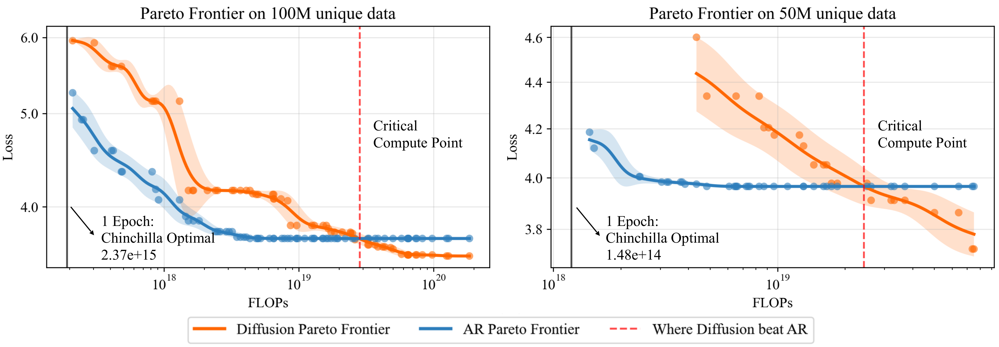

<!-- TITLE -->
# **Diffusion Beats Autoregressive in Data-Constrained Settings**

This is the official implementation of our paper [Diffusion Beats Autoregressive in Data-Constrained Settings](https://diffusion-scaling.github.io/)

<!-- DESCRIPTION -->
## Abstract
Autoregressive (AR) models have long dominated the landscape of large language models, driving progress across a wide range of tasks. Recently, diffusion-based language models have emerged as a promising alternative, though their advantages over AR models remain underexplored. In this paper, we systematically study masked diffusion models in data-constrained settings—where training involves repeated passes over limited data—and find that they significantly outperform AR models when compute is abundant but data is scarce. Diffusion models make better use of repeated data, achieving lower validation loss and superior downstream performance. We interpret this advantage as implicit data augmentation: masked diffusion exposes the model to a diverse distribution of token orderings and prediction tasks, unlike AR's fixed left-to-right factorization. We find new scaling laws for diffusion models and derive a closed-form expression for the critical compute threshold at which diffusion begins to outperform AR. These results suggest that when data, not compute, is the bottleneck, diffusion models offer a compelling alternative to the standard AR paradigm.

